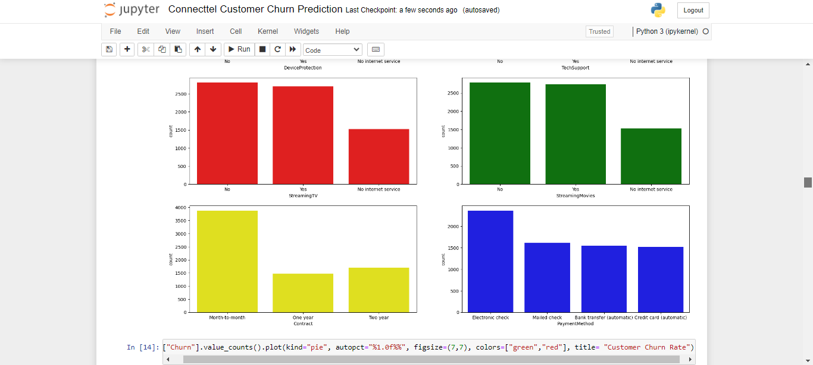

# Connecttel-Customer-Churn-Prediction

I wholeheartedly endorse this data-driven initiative. Tackling customer churn through advanced analytics and machine learning is pivotal for ConnectTel's success in the telecom industry. By leveraging supervised machine learning algorithms, this project promises to predict and prevent customer attrition, ensuring long-term loyalty and competitiveness. Join this journey to witness the transformation of ConnectTel into a forward-thinking telecom leader, ready to secure its future in the digital age.

 
